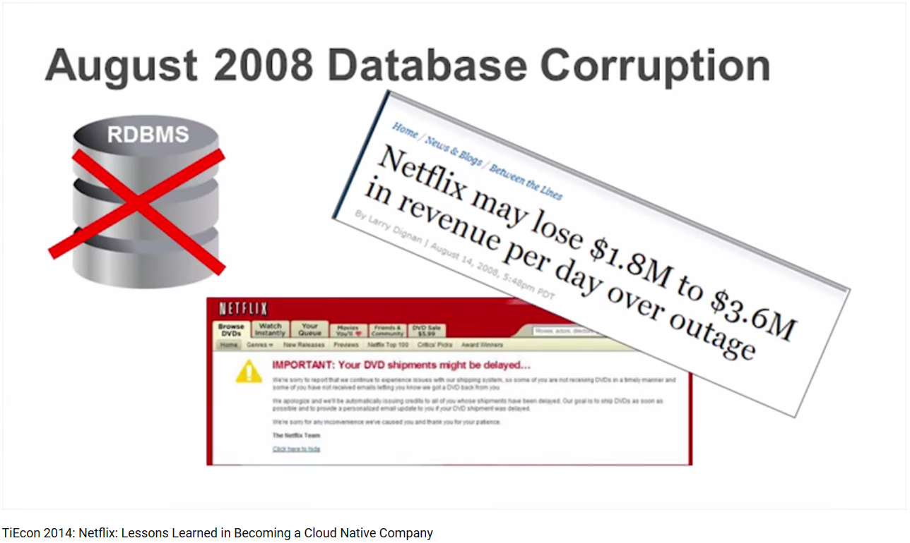
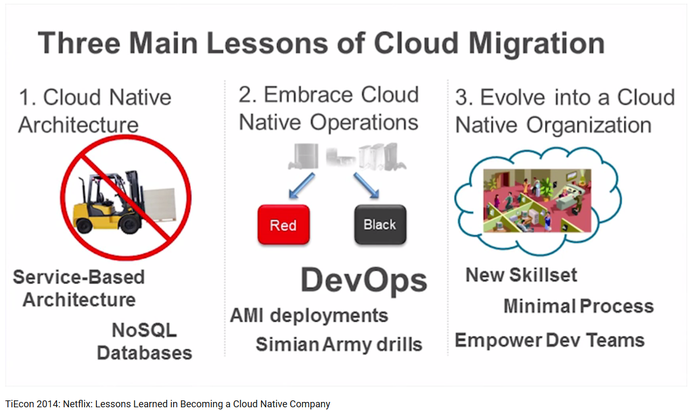

Completing the Netflix Cloud Migration
======================================
Netflix journey to the cloud began in August of 2008, when they experienced a major database corruption and for three days could not ship DVDs to our members. Completing the Netflix Cloud Migration in early [January, 2016][1], after seven years of diligent effort, they have finally completed their cloud migration and shut down the last remaining data center bits used to stream services their streaming service!

Starting the journey in 2008
----------------------------
When Netflix experienced a major database corruption and for three days could not ship DVDs to their members, they realized that they had to move away from vertically scaled single points of failure, like relational databases in the datacenter, towards highly reliable, horizontally scalable, distributed systems in the cloud.

 They chose Amazon Web Services (AWS) as the cloud provider because it provided them with the greatest scale and the broadest set of services and features. *"We simply could not have racked the servers fast enough,"* explained Yury Izrailevsky, VP Netflix. *"Elasticity of the cloud allows us to add thousands of virtual servers and petabytes of storage within minutes."*

Scalability, Performance and Availability
-----------------------------------------
On January 6, 2016, Netflix expanded their service to over 130 new countries, becoming a truly global Internet TV network. Its streaming service grew by more than 100 times, and the company was able to realize tremendous advantages in terms of performance, availability and the pace of innovation. Leveraging multiple AWS cloud regions, spread all over the world, enabling them to dynamically shift around and expand their global infrastructure capacity. The majority of the systems, including all customer-facing services, had been migrated to the cloud prior to 2015. Since then, they've been taking the time necessary to figure out a secure and durable cloud path for the billing infrastructure as well as all aspects of the customer and employee data management.

Becoming a Cloud Native Company
-------------------------------
Given the obvious benefits of the cloud, why did it take them a full seven years to complete the migration? The truth is, moving to the cloud was a lot of hard work, and they had to make a number of difficult choices along the way.

*"Arguably, the easiest way to move to the cloud is to forklift all of the systems, unchanged, out of the data center and drop them in AWS. But in doing so, you end up moving all the problems and limitations of the data center along with it."* said Izrailevsky at TiEcon 2014: [Netflix: Lessons Learned in Becoming a Cloud Native Company][2]

Many new systems had to be built, and new skills learned. Architecturally, they migrated from a monolithic app to hundreds of micro-services, and denormalized their data model, using NoSQL databases. They chose the cloud-native approach, rebuilding virtually all of our technology and fundamentally changing the way they operate the company. Budget approvals, centralized release coordination and multi-week hardware provisioning cycles made way to continuous delivery, engineering teams making independent decisions using self service tools in a loosely coupled DevOps environment, helping accelerate innovation. It took time and effort to transform Netflix into a cloud-native company.

[1]: https://media.netflix.com/en/company-blog/completing-the-netflix-cloud-migration
[2]: https://www.youtube.com/watch?v=BTFRWsniH3k
